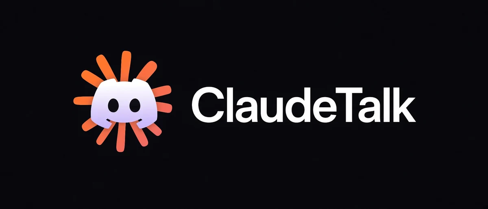

<h1 align="center">ClaudeTalk</h1>

<h3 align="center">Your Claude Code sessions, from any device</h3>

<p align="center">
  
</p>

<p align="center">
  <a href="LICENSE"></a>
  <a href="https://github.com/Guappa/claudetalk/actions/workflows/ci.yml"></a>
  
  
  <a href="https://github.com/Guappa/claudetalk/releases.atom"></a>
</p>

Talk to Claude Code sessions running on your own machine from Discord, on any device.

Each Discord channel is one conversation. Message a channel and it resumes that
conversation on your machine, whether or not a terminal is open for it. Close
your terminal, pick it up from your phone, then resume the same conversation in
the CLI later with its full history intact. The conversation lives in Claude
Code's own transcript, so nothing here owns it.

When Claude stops to ask you something, the questions arrive as select menus
with the choices it offered, an "Other..." for your own words, and a Submit
button, the same exchange the terminal shows as a wizard.

## Requirements

- Node 22.12 or newer
- Claude Code, signed in with a claude.ai subscription (`claude auth login`). Sign in as
  the same account the bridge runs as: it refuses to start against a signed-out
  Claude Code, since every turn would fail the moment anyone sent one
- A Discord server you administer

Turns run through `@anthropic-ai/claude-agent-sdk`, which `npm ci` installs and
which starts the same `claude` binary you already have. This bridge is MIT; that
package is not, so using it means accepting
[Anthropic's terms](https://code.claude.com/docs/en/legal-and-compliance). That
is the same agreement Claude Code itself is under, so it asks nothing new of
you, but a fork should know it is there.

## Security, read this first

**There is no sandbox.** Every turn runs as the user the bridge runs as, with
your files, credentials, SSH keys and Claude plan. Setting
`CLAUDE_TOOL_APPROVALS=true` makes an owner approve each command, edit and fetch
from Discord first, which shows you every step without limiting what a step may
do.

**Only owners and operators can use it.** Everyone else is ignored: messages
dropped, commands refused, nothing reaching a session. `/invite` lets someone see
a conversation's channel and talk in it, and grants no use of the bot.

**Owners are set on the host**, in `DISCORD_OWNER_IDS`, and nothing inside
Discord can add or remove one. An owner is the only one who can make somebody an
operator, with `/operator add`.

**Making someone an operator gives them your machine.** It is the same as leaving
them alone at your unlocked PC.

**A compromised account is a way in, and 2FA does not close it.** A stolen
Discord session token is enough on its own: it carries no password prompt and no
second factor. Token-stealing malware targets Discord specifically and is common.
Every account with access is another machine that has to stay clean, not just
another person you have to trust. That includes your own.

**Enable two-factor authentication** on the Discord account that owns the bot
application anyway. For containment, run the bridge in a container or VM.

Every turn runs against the host's Claude subscription. Sharing that is not
something the Anthropic terms permit; for a team, run one bridge per person.

The full access model is in [docs/REFERENCE.md](docs/REFERENCE.md#access).

## Setting up the Discord bot

1. Go to the [Discord Developer Portal](https://discord.com/developers/applications)
   and click **New Application**. Name it whatever you like.
2. Open the **Bot** tab. Click **Reset Token**, then copy the token. This is
   `DISCORD_BOT_TOKEN`. It is shown once.
3. Still on the **Bot** tab, scroll to **Privileged Gateway Intents** and enable
   **Message Content Intent**. Without it the bot receives empty messages.
4. Open **OAuth2 > URL Generator**. Tick the `bot` and
   `applications.commands` scopes, then tick these bot permissions:
   View Channels, Manage Channels, Manage Roles, Send Messages, Send Messages in
   Threads, Read Message History, Attach Files, Add Reactions.
   Manage Channels lets `/create` make a channel per conversation; Manage Roles
   is what makes that channel private to you.
5. Open the generated URL and add the bot to your server.
6. In Discord, enable **Settings > Advanced > Developer Mode**. Then right-click
   your server for **Copy Server ID** (`DISCORD_GUILD_ID`) and right-click
   yourself for **Copy User ID** (`DISCORD_OWNER_IDS`).

## Configuration

```bash
cp .env.example .env
```

| Variable | What it is |
| --- | --- |
| `DISCORD_BOT_TOKEN` | From step 2 above |
| `DISCORD_GUILD_ID` | The one server the bot answers in |
| `DISCORD_OWNER_IDS` | Who owns the bridge, comma separated. Full access, and the only ones who can add an operator. Cannot be changed from Discord |
| `DISCORD_CATEGORY_ID` | Optional. Where conversation channels are created, and the only place plain messages are acted on |
| `WORKSPACES_ROOT` | Optional. Parent folder for per-operator workspaces. Required before other operators can create conversations |
| `PROJECTS_ROOT` | Filesystem path. Folder new conversations are created under by default. Not a Discord channel |
| `CLAUDE_BIN` | Optional, path to `claude` if it is not on PATH |
| `CLAUDE_TOOL_APPROVALS` | Optional, `false` by default. `true` asks an owner in Discord before each command, file edit or web fetch |
| `BINDINGS_PATH` | Optional, defaults to `data/conversations.json` |
| `OPERATORS_PATH` | Optional, defaults to `data/operators.json` |

## Running

```bash
npm ci
```

Then install it as a background service. A terminal is for trying it out.

**Windows** (registers a scheduled task, asks for administrator rights, then
continues in the elevated window it opens)

```powershell
powershell -ExecutionPolicy Bypass -File scripts\install-autostart.ps1
powershell -ExecutionPolicy Bypass -File scripts\install-autostart.ps1 -Action status
powershell -ExecutionPolicy Bypass -File scripts\install-autostart.ps1 -Action uninstall
```

Starts 30 seconds after boot and after logon, retries three times if it exits,
and writes to `data/bridge.log`. It runs windowless, as you, with no desktop
session.

**Linux** (writes a systemd user service and enables lingering)

```bash
scripts/install-autostart.sh
scripts/install-autostart.sh status
scripts/install-autostart.sh uninstall
```

Starts at boot without you logging in, restarts on failure, gives up after five
failures in five minutes. Logs:
`journalctl --user -u claudetalk.service -f`.

**macOS** (writes a launchd user agent)

```bash
scripts/install-autostart-macos.sh
scripts/install-autostart-macos.sh status
scripts/install-autostart-macos.sh uninstall
```

Starts when you log in, restarts if it exits badly, waits ten seconds between
tries. Logs: `tail -f data/bridge.log`. Unlike the Linux service this is a login
agent, not a boot service, so it does not run before you sign in. Running the
Linux script on macOS refuses and points here, since macOS has no systemd.

CI installs, reports and removes this agent on a real macOS runner, so the plist
is known to be one `launchctl` accepts. What no machine here has done is log
into a Mac desktop and watch it come up after a reboot, so the GUI session and
the login-time start are the parts still taken on trust.

To try it in a terminal instead:

```bash
npm run dev      # start it here
npm run stop     # stop whichever instance is running
```

Only one bridge may run at a time; a lock file prevents a second. Stop it with
`npm run stop` rather than killing it. That waits for any turn in flight,
queued messages included, admits nothing new meanwhile, and says what it is
waiting on. `npm run stop:now` cuts running turns short instead, and their
progress messages end with "Stopped." The Linux service and the macOS agent
treat their own stop the same way, with a thirty minute ceiling before the
system kills the bridge; the Windows task's own stop kills it at once, so use
`npm run stop` there. If the bridge is killed anyway, a progress message it left
mid-turn is marked as interrupted the next time it starts.

Both platforms run the bridge straight from `src/`. Node strips the types, so
there is no build step.

## Commands

`/create` makes a channel and starts a conversation in it. `/resume` does the
same for one that already exists on the host. `/fork` branches one. `/sessions`
lists them. `/invite` shares one with someone else.

**[docs/REFERENCE.md](docs/REFERENCE.md) is the full list**: every command, who
may run it, the access model, what context costs, collision rules, and
troubleshooting.

## Development

See [CONTRIBUTING.md](CONTRIBUTING.md) for the tests, the workflow and the
constraints worth knowing before changing anything.

## Licence

MIT
